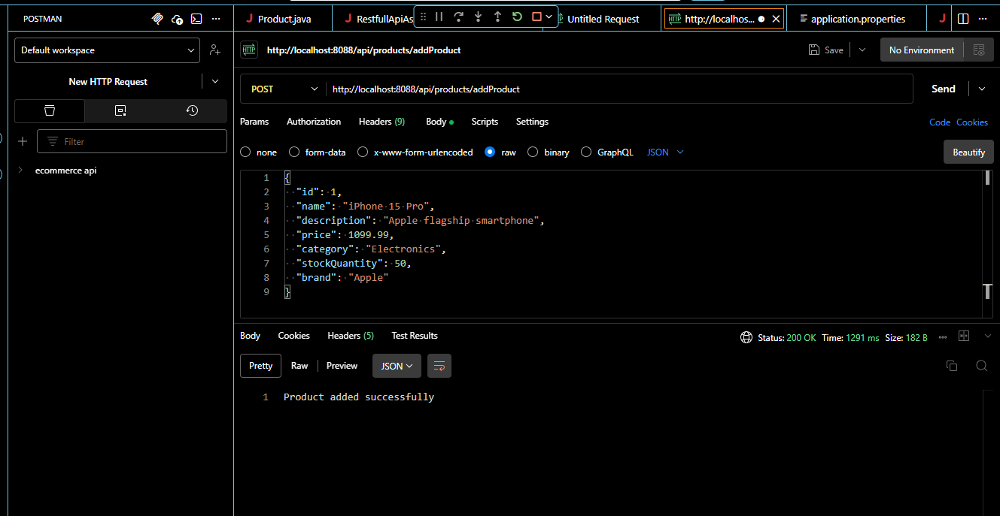

# RESTful API Assignment

This project is a simple Spring Boot application demonstrating a RESTful API for managing products. The application includes basic CRUD operations and filtering capabilities.

## Project Structure

- `src/main/java/auca/ac/rw/restfullApiAssignment` - main package
  - `controller` - contains the `ProductController` class handling HTTP requests
  - `modal` - contains the `Product` entity and other packages for future modules
  - `repository` - `ProductRepository` interface for data access
  - `service` - `ProductService` class implementing business logic
- `src/main/resources/application.properties` - configuration
- `pom.xml` - Maven build file
- `Screenshots1/` - directory containing API usage screenshots

## Requirements

- Java 17 or later (project is compiled against Java 17)
- Maven 3.6+

## Setup & Running

1. Clone or download the repository.
2. Navigate to the project root where `pom.xml` is located.
3. Build the project:
   ```bash
   mvn clean package
   ```
4. Run the application:
   ```bash
   mvn spring-boot:run
   ```
   or run the generated jar:
   ```bash
   java -jar target/restfullApiAssignment-0.0.1-SNAPSHOT.jar
   ```
5. The API will start on **http://localhost:8088** (configured in `application.properties`).  The base path for all endpoints is `/api/products`.

## API Endpoints

The following endpoints are available. Each row shows the full request URL (base URL plus path):

| HTTP Method | Path                                                                 | Description                                      |
|-------------|----------------------------------------------------------------------|--------------------------------------------------|
| POST        | `/api/products/addProduct`                                           | Add a new product                                |
| GET         | `/api/products/getAllProducts`                                       | Retrieve all products                            |
| GET         | `/api/products/getProduct/{id}`                                      | Retrieve product by ID                           |
| GET         | `/api/products/getProductsByCategory/{category}`                     | Retrieve products by category                    |
| GET         | `/api/products/getProductsByBrand/{brand}`                          | Retrieve products by brand                       |
| GET         | `/api/products/getProductsByBrandAndCategory?brand=&category=`       | Retrieve products filtered by brand **and** category (query parameters) |
| GET         | `/api/products/getProductsByPriceAndBrand?price=&brand=`             | Retrieve products filtered by price **and** brand (query parameters) |
| PUT         | `/api/products/updateProduct/{id}`                                   | Update product details (name, price, etc.)      |
| PATCH       | `/api/products/updateStock/{id}?newStockQuantity=<value>`            | Update only the stock quantity                   |
| DELETE      | `/api/products/deleteProduct/{id}`                                   | Delete a product                                 |

## Sample Interactions

Below are screenshots demonstrating use cases. Each image is embedded below with a short description.  Paths shown in screenshots reflect the real base URL and endpoints (port 8088 with `/api/products`).

### Adding a Product


### Getting All Products


### Getting by Category


### Getting by Brand


### Getting by Price and Brand


### Getting by ID


### Checking Existence


### Updating Stock


### Updating a Product


### Deleting a Product


> **Note:** Ensure the `Screenshots1` folder is at the repository root so that image paths resolve correctly.

> **Note:** Browse the screenshots directory to view the images.

## Data Used

The project does not include a pre-populated database. You can create products via the `addProduct` endpoint using JSON payloads like:

```json
{
  "id": 1,
  "name": "Sample Product",
  "description": "A short description",
  "category": "Electronics",
  "brand": "ACME",
  "price": 99.99,
  "stockQuantity": 10
}
```

## License

This project is provided for educational purposes.
